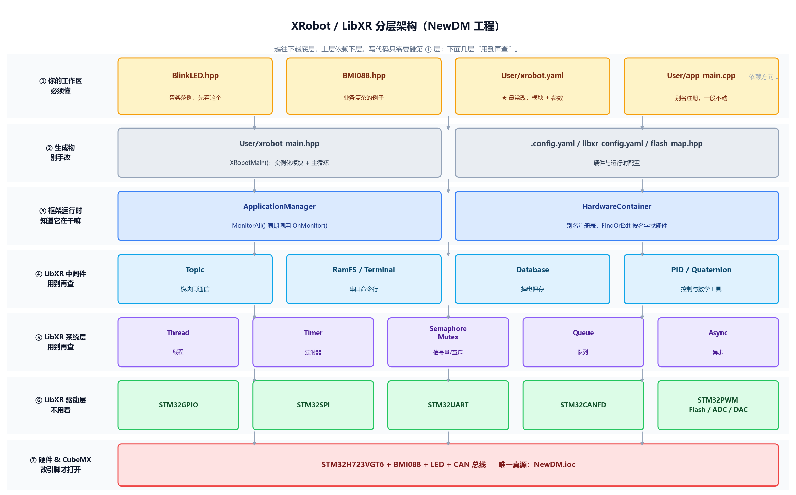
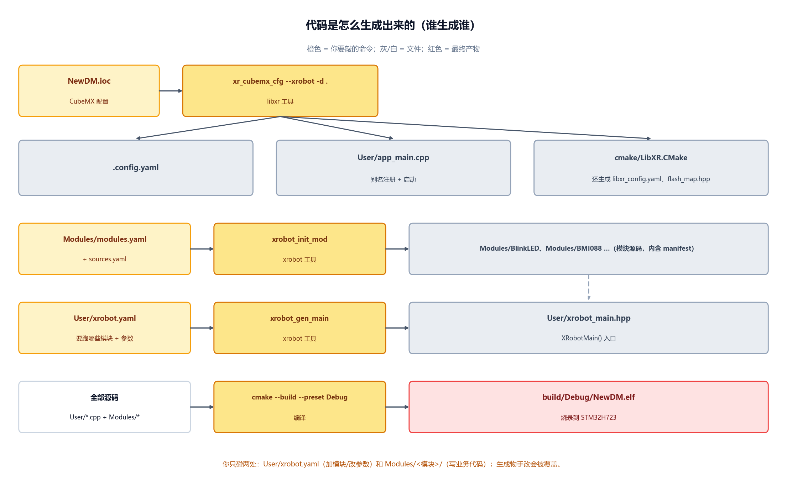
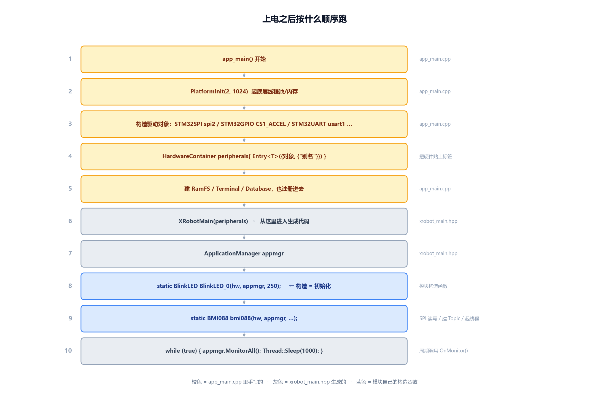
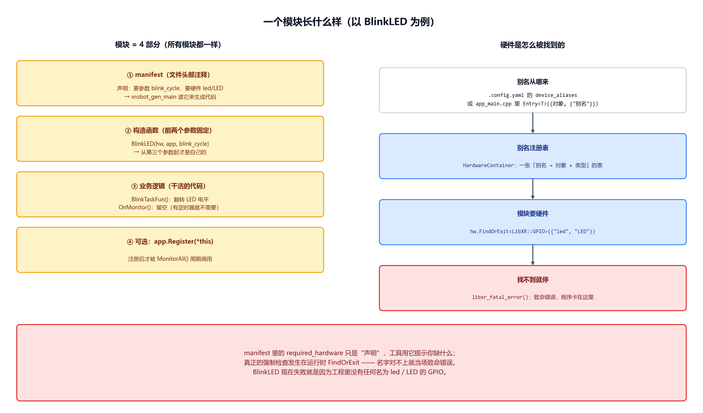

# XRobot 框架上手指南（NewDM 工程）

> 面向第一次接触 LibXR / XRobot 的人。读完这一页，你应该知道「改哪个文件、跑哪条命令、出问题去哪看」。

> 🐣 **第一次接触 C++ / 觉得官方文档太高深？** 先看 `docs/xrobot-beginner-guide.md`
> （教学版：用本工程真实代码，一边讲框架设计思想，一边补 C++ 基础）。本文是速查版，适合上手之后回来查命令。

## 先看这 4 张图

文字看不进去就先只看图。图片在 `docs/images/` 下，也可以直接在 VS Code 或文件管理器里点开。

### 图 1：整体分层架构

越往下越底层。**写代码只需要碰第 ① 层**，下面几层用到再查。



### 图 2：代码是怎么生成出来的

橙色是你要敲的命令，灰色是生成物。**你只碰两处**：`User/xrobot.yaml` 和 `Modules/<模块>/`。



### 图 3：上电之后按什么顺序跑

第 8、9 步构造模块对象时就执行了初始化，所以是「构造即初始化」。



### 图 4：一个模块长什么样 + 硬件是怎么被找到的

所有模块都是同一个骨架，差别只在第 ③ 部分业务代码的多少。



## 0. 一句话总览

这套框架解决的是**「硬件初始化」和「业务模块」解耦**：

- 你只写「模块」（比如 BMI088 驱动、底盘控制），模块不关心引脚是哪个、挂在哪条 SPI 上。
- `app_main.cpp` 启动时把所有硬件对象**注册成别名**，模块用别名去要硬件。
- `XRobotMain()` 负责把模块**实例化**并周期调用。

```
STM32CubeMX(.ioc) ──► .config.yaml ──► app_main.cpp(注册硬件别名)
                                          │
Modules/*.hpp (manifest) ─┐               ▼
User/xrobot.yaml ─────────┴──► xrobot_main.hpp ──► XRobotMain(hw) ──► 模块实例运行
```

## 1. 三个东西，别混

| 名字 | 是什么 | 干什么 | 你会不会直接改 |
| --- | --- | --- | --- |
| **LibXR** | C++ 库（`Middlewares/Third_Party/LibXR`，编译成 `xr`） | 驱动抽象（GPIO/SPI/UART/CAN…）、系统原语（Thread/Timer/Queue）、中间件（Topic/RamFS/Database/Terminal）、工具（PID/Quaternion） | 基本不改 |
| **libxr** | Python 包（命令 `xr_*`） | 读 `.ioc` → 生成 `.config.yaml`、`app_main.cpp`、`flash_map.hpp`、`libxr_config.yaml`、`cmake/LibXR.CMake` | 改生成结果里的 `User Code` 区 |
| **xrobot** | Python 包（命令 `xrobot_*`） | 管模块仓库（clone/同步）、读模块 manifest + `xrobot.yaml` → 生成 `User/xrobot_main.hpp` | 改 `xrobot.yaml`，然后重新生成 |

## 2. 工程文件对照表

| 文件 | 谁生成 | 作用 | 你该不该手改 |
| --- | --- | --- | --- |
| `NewDM.ioc` | CubeMX | 引脚/外设/时钟的唯一真源 | 改（用 CubeMX GUI） |
| `.config.yaml` | `xr_*` | `.ioc` 的结构化结果 | 不直接改 |
| `User/app_main.cpp` | `xr_*` | 建驱动对象 + `HardwareContainer` 别名注册 + 调 `XRobotMain` | 只在 `User Code Begin/End` 区内改 |
| `User/libxr_config.yaml` | `xr_*` | 缓冲区/队列大小、`SYSTEM: FreeRTOS` 等运行时配置 | 可改 |
| `Modules/modules.yaml` | 你 / xrobot | 需要哪些**模块仓库**（`命名空间/模块名@版本`） | 改（或 `xrobot_add_mod`） |
| `Modules/sources.yaml` | `xrobot_src_man` | 模块索引源（官方 / 私有镜像） | 改 |
| `Modules/<Mod>/*.hpp` | 模块作者 | 模块实现 + 头部 manifest（构造参数、需要的硬件） | 用 `xrobot_create_mod` 新建 |
| `User/xrobot.yaml` | 你 / `xrobot_gen_main` | 要跑哪些**模块实例**、每个实例的构造参数 | **最常改的就是这个** |
| `User/xrobot_main.hpp` | `xrobot_gen_main` | 生成的模块实例化 + 主循环 | 不手改（会被覆盖） |

## 3. 启动时到底发生了什么

`User/app_main.cpp` 的 `app_main()`：

1. `PlatformInit(2, 1024)` —— 起底层（线程池/内存）。
2. 依次构造驱动对象：`STM32GPIO` / `STM32SPI` / `STM32UART` / `STM32CANFD` …
3. 构造 `LibXR::HardwareContainer peripherals{ Entry<T>({obj, {"别名1", "别名2"}}), ... }` —— **别名注册表**。
4. 建 `RamFS` / `Terminal` / `Database`，也注册进 `peripherals`。
5. 调 `XRobotMain(peripherals)`。

`User/xrobot_main.hpp` 的 `XRobotMain(hw)`：

1. 定义 `ApplicationManager appmgr`。
2. **构造每个模块对象**（`static` 变量，只构造一次）。模块构造函数里做初始化：
   `hw.FindOrExit<T>({别名})` 取硬件、建 Topic、`app.Register(*this)`、建线程/定时器。
3. 死循环：`appmgr.MonitorAll()`（调用所有已注册模块的 `OnMonitor()`）+ `Thread::Sleep(1000)`。

> `Thread::Sleep(1000)` 的值来自 `User/xrobot.yaml` 里的 `global_settings.monitor_sleep_ms`。

## 4. 一个模块的三条契约

1. **继承 `LibXR::Application`**，实现 `void OnMonitor() override`（不需要周期监控就写空）。
2. **构造函数签名固定前两个参数**：

   ```cpp
   MyModule(LibXR::HardwareContainer& hw, LibXR::ApplicationManager& app, ...自定义参数);
   ```

3. **头部必须有 manifest 注释块**，`xrobot_gen_main` 全靠它：

   ```cpp
   /* === MODULE MANIFEST V2 ===
   module_description: 一句话描述
   constructor_args:
     - period_ms: 500
   template_args: []
   required_hardware: led/LED
   depends: []
   === END MANIFEST === */
   ```

   注意 `required_hardware: led/LED` 里的 `/` 表示**任一别名命中即可**，等价于代码里的
   `hw.FindOrExit<LibXR::GPIO>({"led", "LED"})`。

最小可用模块模板：

```cpp
#pragma once

// clang-format off
/* === MODULE MANIFEST V2 ===
module_description: 我的第一个模块
constructor_args:
  - period_ms: 500
template_args: []
required_hardware: led/LED
depends: []
=== END MANIFEST === */
// clang-format on

#include "app_framework.hpp"
#include "gpio.hpp"
#include "timer.hpp"

class MyModule : public LibXR::Application {
 public:
  MyModule(LibXR::HardwareContainer& hw, LibXR::ApplicationManager& app,
           uint32_t period_ms)
      : led_(hw.template FindOrExit<LibXR::GPIO>({"led", "LED"})),
        timer_(LibXR::Timer::CreateTask(TaskFun, this, period_ms)) {
    app.Register(*this);
    LibXR::Timer::Add(timer_);
    LibXR::Timer::Start(timer_);
  }

  static void TaskFun(MyModule* self) { self->led_->Write(self->flag_ = !self->flag_); }

  void OnMonitor() override {}

 private:
  bool flag_ = false;
  LibXR::GPIO* led_;
  LibXR::Timer::TimerHandle timer_;
};
```

模块间通信不靠直接引用，靠 **Topic**：生产者 `LibXR::Topic::CreateTopic<T>("名字")` 后 `Publish`，
消费者按名字订阅。BMI088 就是把陀螺仪/加速度数据发到 `bmi088_gyro` / `bmi088_accl` 两个 Topic。

## 5. 日常五件事：改哪里、跑什么命令

> 命令都在**工程根目录**执行。`xrobot_*` / `xr_*` 已用 pipx 安装在
> `C:\Users\liaoz\.local\bin`，若提示找不到命令，把这个目录加进 PATH 或重开终端。

| 我想做的事 | 改哪个文件 | 跑什么命令 |
| --- | --- | --- |
| 改模块参数 / 加一个模块实例 | `User/xrobot.yaml` | `xrobot_gen_main -o User/xrobot_main.hpp` |
| 加一个新的第三方模块 | `Modules/modules.yaml` | `xrobot_add_mod 名字空间/模块名` 然后 `xrobot_init_mod` |
| 写一个新模块 | 新建 `Modules/MyMod/MyMod.hpp` | `xrobot_create_mod MyMod --desc "..." --hw spi1` |
| 查看模块需要什么参数/硬件 | 不改 | `xrobot_mod_parser --path Modules/BMI088/` |
| 改引脚 / 加外设 | `NewDM.ioc` | CubeMX 生成后 `xr_cubemx_cfg --xrobot -d .` |
| 编译 | 不改 | `cmake --build --preset Debug --parallel 8` |

## 6. 命令速查

```powershell
# 一键：建 Modules 目录、拉模块、生成主函数（首次用）
xrobot_setup

# 只同步模块仓库（modules.yaml 改过之后）
xrobot_init_mod --config Modules\modules.yaml --directory Modules --sources Modules\sources.yaml

# 只重新生成主函数（xrobot.yaml 改过之后）
xrobot_gen_main --output User\xrobot_main.hpp

# 把模块加入 modules.yaml（仓库引用） / 加入 xrobot.yaml（实例）
xrobot_add_mod xrobot-org/BMI088
xrobot_add_mod BMI088

# 新建模块骨架
xrobot_create_mod MyModule --desc "我的模块" --hw spi1 --constructor period_ms=500

# 查看模块 manifest
xrobot_mod_parser --path Modules\BMI088\
```

## 7. 这个工程当前要注意的点

1. **`BlinkLED_0` 现在跑不起来。** 它要求 `led/LED/led1/LED1` 别名，但
   `User/app_main.cpp` 的 `peripherals` 里没有注册任何 LED，`.config.yaml` 里也没有 LED 引脚。
   `FindOrExit` 找不到就会走 `REQUIRE` → `libxr_fatal_error(__FILE__, __LINE__, in_isr)`，
   也就是**一上电构造 `BlinkLED_0` 就进入致命错误**（此时它的闪灯回调还没注册，所以不会闪灯）。
   **修复**：在 CubeMX 里配一个 GPIO 输出（比如 `LED1`），重新生成，然后在 `app_main.cpp`
   里加一行 `LibXR::Entry<LibXR::GPIO>({LED1, {"LED1", "led"}})`。
2. `User/xrobot.yaml` 里的参数是**最终生效值**，优先级高于模块 manifest 里的默认值
   （例如 BMI088 的 `gyro_freq` 两处不一致，以 `xrobot.yaml` 为准）。
3. `.config.yaml` 里 `FreeRTOS.Enabled: false`，但 `cmake/LibXR.CMake` 写死了
   `LIBXR_SYSTEM FreeRTOS`、`User/libxr_config.yaml` 也是 `SYSTEM: FreeRTOS`。
   目前能编译；若之后报线程相关链接错误，先查这里是否一致。
4. `User/xrobot_main.hpp` 是生成物，改了会被覆盖；要加自己的启动逻辑，写进
   `app_main.cpp` 的 `/* User Code Begin 3 */` 区，或在模块构造函数里做。

## 8. 建议的学习路线

1. 先只动手改 `User/xrobot.yaml`（改 `blink_cycle`）→ `xrobot_gen_main` → 看 `xrobot_main.hpp` 变化。
   目的是建立「配置 → 代码」的直觉。
2. 把 LED 别名补上，让 `BlinkLED` 真的闪起来（见第 7 节第 1 条）。
3. 写一个自己的小模块（第 4 节模板），用 `xrobot_create_mod` 生成、`xrobot_add_mod` 加入实例。
4. 需要传感器数据时，再看 `Modules/BMI088/BMI088.hpp` 里 Topic 和 `Database` 的用法。
